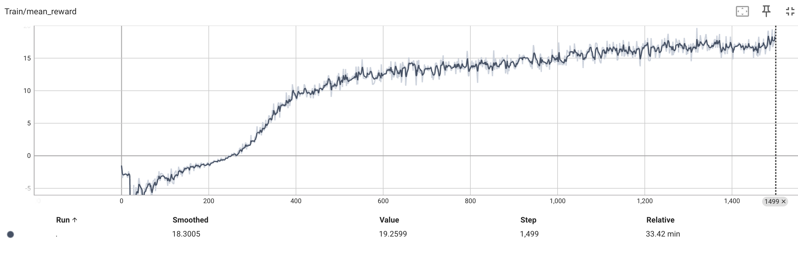
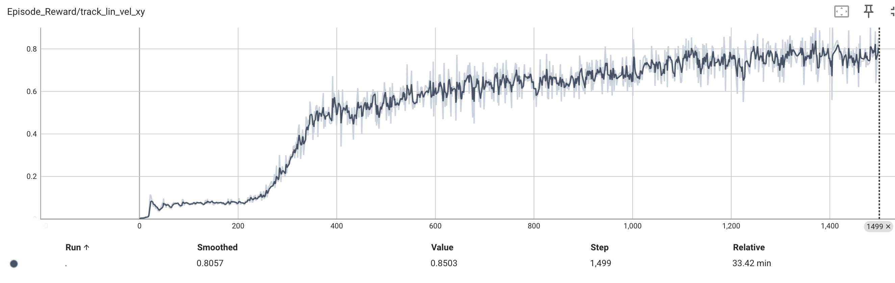
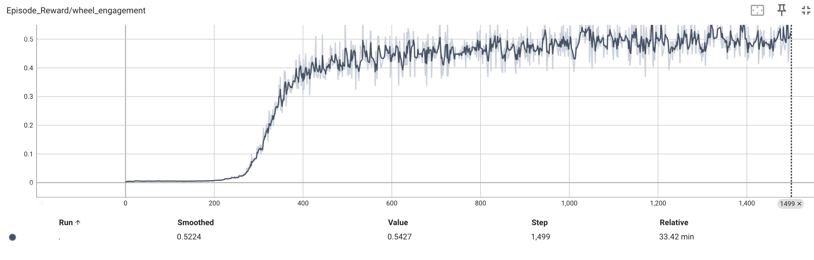
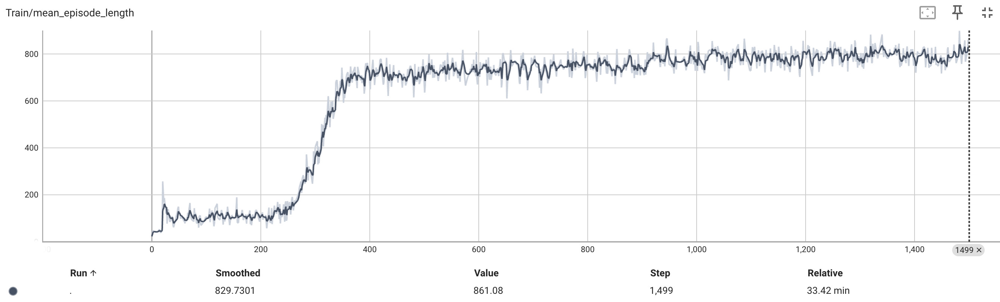

# Unified Wheeled-Legged Locomotion via Reinforcement Learning on the Unitree B2-W

A single RL policy trained end-to-end in IsaacLab that learns to coordinate wheel spinning and leg posture for locomotion on the Unitree B2-W — a quadruped with actuated wheels at the end of each leg.

---

## Results

The hybrid policy achieves strong velocity tracking and naturally learns to engage wheels during forward locomotion — no explicit mode switching or gating mechanism required.

| Metric | Value |
|---|---|
| Mean reward (iter 1500) | **+18.3** |
| Velocity tracking reward | **0.85** |
| Wheel engagement | **0.52** |
| Mean episode length | **830 / 1000 steps** |

### Learning Curves

**Mean Reward** — clean monotonic improvement from -5 → +18 over 1500 iterations, with a phase transition at ~iteration 300 where locomotion emerges:



**Velocity Tracking** — rises from 0 to 0.85, indicating the policy successfully tracks commanded xy velocities:



**Wheel Engagement** — jumps from 0 to 0.52 at the same phase transition, showing wheel spinning co-emerges with locomotion:



**Episode Length** — grows from ~100 to 830 steps, confirming the robot stays alive and moving:



---

## Method

### Robot

[Unitree B2-W](https://www.unitree.com/b2w/) — a 60kg wheeled quadruped with:
- 12 leg joints (hip/thigh/calf per leg), torque range ±200–300 Nm
- 4 wheel joints (one per leg), torque range ±20 Nm

### Policy

A single MLP policy (512 → 256 → 128) trained with PPO via [RSL-RL](https://github.com/leggedrobotics/rsl_rl).

**Observation space (40 dims):**
- Base linear velocity (3)
- Base angular velocity (3)
- Projected gravity (3)
- Leg joint positions (12)
- Leg joint velocities (12)
- Wheel velocities (4)
- Velocity command (3)

**Action space (16 dims):**
- 12 leg joint position targets (±0.5 rad offset from default)
- 4 wheel velocity targets (±10 rad/s)

### Reward

| Term | Weight | Purpose |
|---|---|---|
| `track_lin_vel_xy` | +1.5 | Track forward velocity command |
| `track_yaw_rate` | +0.75 | Track yaw rate command |
| `wheel_engagement` | +0.5 | Reward wheel spinning during motion |
| `flat_orientation_l2` | -0.5 | Penalize tipping |
| `lin_vel_z_l2` | -0.5 | Penalize bouncing |
| `ang_vel_xy_l2` | -0.05 | Penalize roll/pitch |
| `leg_torques_l2` | -1e-4 | Encourage efficient leg use |
| `stand_still_penalty` | -0.5 | Force movement when commanded |
| `action_rate_l2` | -0.01 | Smooth control |

The `wheel_engagement` term is the key design choice: it rewards `cmd_speed × mean_wheel_speed`, encouraging the policy to spin wheels proportionally to how fast it's commanded to go.

---

## Setup

### Requirements

- AWS EC2 `g4dn.xlarge` (Tesla T4, 16GB VRAM) or equivalent
- Ubuntu 24.04
- Python 3.10
- [IsaacLab v1.2.0](https://github.com/isaac-sim/IsaacLab/tree/v1.2.0)
- Isaac Sim 4.2 (via pip)

### Installation

```bash
# Clone IsaacLab v1.2.0
git clone https://github.com/isaac-sim/IsaacLab.git ~/IsaacLab
cd ~/IsaacLab
git checkout v1.2.0

# Install Isaac Sim 4.2
conda create -n isaaclab python=3.10 -y
conda activate isaaclab
pip install isaacsim-rl==4.2.0.2 isaacsim-replicator==4.2.0.2 \
  isaacsim-extscache-physics==4.2.0.2 \
  isaacsim-extscache-kit==4.2.0.2 \
  isaacsim-extscache-kit-sdk==4.2.0.2 \
  --extra-index-url https://pypi.nvidia.com/

# Install IsaacLab (skip rl frameworks, install separately)
./isaaclab.sh --install none
pip install rsl-rl-lib torch==2.4.0 onnx==1.16.1

# Get the B2-W robot
git clone https://github.com/unitreerobotics/unitree_mujoco.git ~/unitree_mujoco

# Install Xvfb (needed for headless rendering)
sudo apt-get install -y xvfb libglu1-mesa
```

### Convert Robot Asset

```bash
mkdir -p ~/b2w_asset_simple
cd ~/IsaacLab
./isaaclab.sh -p source/standalone/tools/convert_mjcf.py \
  ~/unitree_mujoco/unitree_robots/b2w/b2w.xml \
  ~/b2w_asset_simple/b2w.usd --headless

# Fix USD default prim and add wheel friction
./isaaclab.sh -p scripts/fix_usd.py --headless  # see scripts/
```

### Train

```bash
export DISPLAY=:0
Xvfb :0 -screen 0 1280x1024x24 &

cd ~/IsaacLab
./isaaclab.sh -p ~/b2w_project/train_b2w_hybrid.py \
  --headless --num_envs 2048 --max_iterations 1500
```

Training takes ~33 minutes on a T4 GPU at ~38,000 steps/second.

### Monitor

```bash
tensorboard --logdir ~/runs --port 6006 --bind_all
# Then SSH tunnel: ssh -L 6006:localhost:6006 ubuntu@YOUR_IP
```

---

## Project Structure

```
b2w_project/
├── b2w_cfg.py              # Robot ArticulationCfg (joints, PD gains, USD path)
├── b2w_wheel_env.py        # Wheel-only baseline environment
├── b2w_hybrid_env.py       # Hybrid policy environment (main contribution)
├── train_b2w_wheel.py      # Wheel baseline training script
├── train_b2w_hybrid.py     # Hybrid training script
└── eval_b2w_hybrid.py      # Evaluation script
```

---

## Key Findings

1. **Wheel-only control is insufficient** — without leg coordination, the robot cannot maintain stable posture while wheels spin, resulting in falls within ~50 steps.

2. **Hybrid emergence** — the policy spontaneously learns to use legs for postural stability and wheels for propulsion. This co-emergence happens at iteration ~300 and is visible as a simultaneous jump in both `wheel_engagement` and `episode_length`.

3. **No explicit gating required** — unlike prior work that uses hand-designed mode switching between walking and rolling, the unified action space allows the policy to discover the optimal leg-wheel coordination implicitly.

---

## Related Work

- Walk These Ways (Kumar et al. 2022) — gait conditioning for quadrupeds
- ANYmal Parkour (Hoeller et al. 2023) — terrain curriculum
- DribbleBot (Ji et al. 2023) — wheeled-legged closest prior work
- OmniLoco (Zhuang et al. 2023) — unified locomotion controllers
